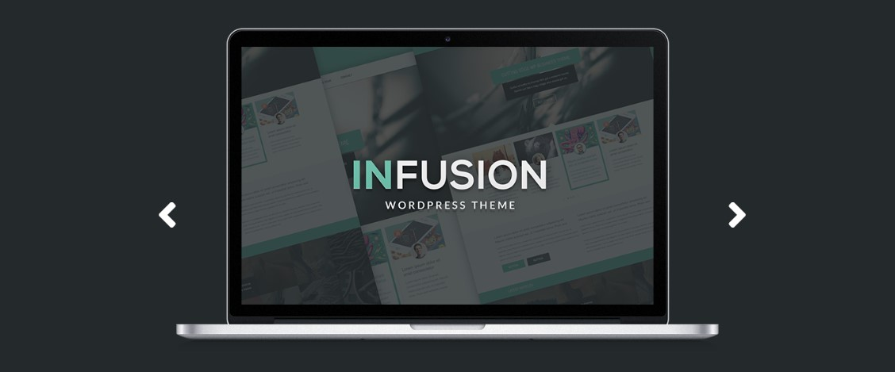

<h1 align="center">
     
    
Desafios e projetos do curso de HTML, CSS e JavaScript

</h1>

# Projeto-Infusion

Projeto mais complexo do curso que traz conceitos de responsividade, menu de hamburguer e corrosel de imagens.  

✅ Responsividade 
✅ Menu de hamburguer 
✅ Carrousel de imagens 
✅ Obejto 
✅ Funções 
✅ Posicionamento de elementos na página 
✅ Display Grid  
O projeto pode ser visualização pelo link abaixo: 
https://devaugustow.github.io/html-css_udemy/projeto-infusion/index.html
  

# Projeto Responsivo

Este projeto teve o intuito de mostrar como usar Media Queries com HTML e CSS para tornar o site responsivo/adaptável em diferentes dispositivos e tamanhos de tela.  

✅ Media Queries 
✅ Posicionamento de elementos 
✅ Display Grid 
O projeto pode ser visualização pelo link abaixo: 
https://devaugustow.github.io/html-css_udemy/projeto-responsivo/index.html
  

# Projeto Strata

É o projeto mais longo do curso e traz consigo um grande apanhado de técnicas usadas em sites dos mais diversos tipos.  
✅ Display 
✅ Positions 
✅ Colunas 
✅ Botões 
✅ Formulários 
✅ Listas 
✅ Tabelas 
✅ Elementos fixos 
✅ Classes e subclasses 
O projeto pode ser visualização pelo link abaixo: 
https://devaugustow.github.io/html-css_udemy/projeto-strata/index.html
  

# Projeto Fashion

Projeto simples que trabalhou com conceitos de posicionamentos verticais e horizontais de elementos, semântica de tags, classes e formatação de texto.  
✅ Tags 
✅ Semântica 
✅ Formatação de texto 
✅ Classes e Pseudoclasses 
✅ Display 
✅ Position 
✅ Float 
O projeto pode ser visualização pelo link abaixo: 
https://devaugustow.github.io/html-css_udemy/projeto-fashion/index.html
  

# Projeto Fundamentos

Projeto mais simples do curso com o único intuito de trabalhar o posionamento de elementos.  
✅ Tags 
✅ Semântica 
✅ Classes e Pseudoclasses 
✅ Display 
✅ Position 
✅ Float 
https://devaugustow.github.io/html-css_udemy/projeto-fundamentos/index.html
  
